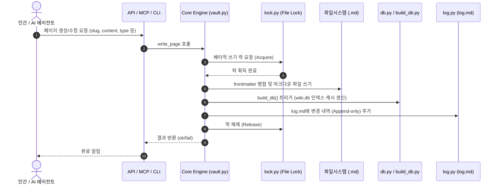

# Raven System Architecture (v0.7.x)

> **BLUF**: Raven은 마크다운 파일(Source of Truth)을 근간으로 하는 로컬 지향(local-first) PKM 도구이며, **4계층 구조(Data, Core Engine, Interface/Adapter, Client/UX)**를 통해 인간 사용자(Dashboard/CLI)와 AI 에이전트(MCP 표준 프로토콜) 모두에게 정합성 있고 격리된 지식 통합 환경을 제공합니다.

---

## 1. 4-Layer 아키텍처 개요

Raven은 데이터와 로직, 진입점을 명확히 분리하기 위해 아래와 같이 **4개 계층(Layer)**으로 설계되었습니다.

```mermaid
flowchart TB
    subgraph Layer4 [Layer 4: Client & UX Layer (사용자/에이전트)]
        Dash[React Dashboard<br/>localhost:5173]
        CLI[Typer CLI<br/>raven cli]
        Agent[AI 에이전트<br/>Claude / Hermes / Cursor]
    end

    subgraph Layer3 [Layer 3: Interface & Communication Layer (진입점)]
        API[HTTP API Server<br/>FastAPI / localhost:8765]
        MCP[MCP Server<br/>FastMCP / localhost:8766]
    end

    subgraph Layer2 [Layer 2: Core Engine Layer (비즈니스 로직)]
        direction TB
        Registry[registry.py<br/>Vault 발견/관리]
        VaultClass[vault.py<br/>Vault CRUD/핸들러]
        DBBuilder[db.py / build_db.py<br/>SQLite 인덱싱]
        Linter[lint.py<br/>14가지 무결성 검증]
        Linker[link.py<br/>Wikilink 파싱/감사]
        Lock[lock.py<br/>파일 락 동시성 제어]
        Log[log.py<br/>log.md 기록기]
    end

    subgraph Layer1 [Layer 1: Vault Data Layer (진실의 원천 - SoT)]
        direction LR
        MD[content/*.md<br/>마크다운 파일]
        SysDoc[_meta/system/<br/>SCHEMA/RULES/AGENTS]
        SQL[wiki.db<br/>SQLite Index Cache]
        LogMD[log.md<br/>작업 감사 로그]
        RegistryJson[.registry.json<br/>중앙 레지스트리]
    end

    %% Interactions
    Dash -->|"HTTP (REST/JSON)"| API
    CLI -->|"직접 라이브러리 참조<br/>또는 HTTP API 호출"| API
    CLI -->|"직접 호출"| VaultClass
    Agent -->|"JSON-RPC (stdio/HTTP)"| MCP
    
    MCP -->|"HTTP API 호출"| API
    API -->|"Core API 호출"| VaultClass
    
    VaultClass --> Registry
    VaultClass --> Lock
    VaultClass --> Log
    DBBuilder --> SQL
    VaultClass --> MD
    VaultClass --> SysDoc
    VaultClass --> LogMD
    Registry --> RegistryJson

    %% Styling
    classDef l4 fill:#e1f5ff,stroke:#01579b,stroke-width:2px;
    classDef l3 fill:#fff3e0,stroke:#e65100,stroke-width:2px;
    classDef l2 fill:#f3e5f5,stroke:#4a148c,stroke-width:2px;
    classDef l1 fill:#e8f5e9,stroke:#2e7d32,stroke-width:2px;
    
    class Dash,CLI,Agent l4;
    class API,MCP l3;
    class Registry,VaultClass,DBBuilder,Linter,Linker,Lock,Log l2;
    class MD,SysDoc,SQL,LogMD,RegistryJson l1;
```

---

## 2. 계층별 세부 아키텍처

### 2-1. Layer 1: Vault Data Layer (데이터 계층)
* **진실의 원천 (SoT - Source of Truth)**: 데이터베이스가 아닌 **로컬 마크다운 파일(`.md`)**이 최종 진실의 원천입니다. DB와 API, UI는 모두 언제든 마크다운으로부터 재생성될 수 있는 파생물입니다.
* **디렉토리 레이아웃**:
  ```text
  ~/Raven/                       <-- Vault 루트 (WIKI_VAULTS_DIR)
  ├── .registry.json             <-- 전체 Vault 목록 및 기본 Vault 설정
  └── <vault-name>/              <-- 개별 Vault 폴더
      ├── .vault.json            <-- Vault 메타데이터 (이름, 모드, 소유자)
      ├── content/               <-- 사용자 작성 마크다운 폴더 (Obsidian 호환 자유 폴더)
      ├── _meta/                 <-- 시스템/운영 규약 문서 (SCHEMA.md, RULES.md, AGENTS.md 등)
      ├── _archive/              <-- 삭제된 마크다운 페이지 백업 폴더
      └── wiki.db                <-- SQLite 쿼리 인덱스 캐시 (gitignored, 빌드 산출물)
  ```
* **wiki.db 스키마 (v2.4)**:
  * `pages`: 페이지 메타(slug, title, type, created/updated, confidence) 및 content 저장
  * `tags`: 다대다 태그 인덱스
  * `links`: wikilink (`[[slug]]`) 기반 문서 연결 및 컨텍스트 보존
  * `pages_fts`: Full-Text Search (FTS5) 가상 테이블 (실시간 BM25 검색 지원)
  * `v_backlinks` (View): 백링크 탐색 성능 향상을 위한 뷰
  * `v_pages_with_tags` (View): 태그가 결합된 페이지 요약 뷰

---

### 2-2. Layer 2: Core Engine Layer (코어 엔진 계층)
비즈니스 로직을 수행하는 Python 패키지(`raven.core`)입니다. CLI, API, MCP가 공통으로 의존하는 커널 역할을 합니다.
* **`registry.py`**: `~/.registry.json` 및 `WIKI_VAULTS_DIR` 환경 변수를 파싱하여 시스템 내 활성화된 Vault들을 검색 및 스위칭합니다.
* **`vault.py`**: 단일 Vault를 다루는 코어 핸들러입니다. CRUD 인터페이스와 데이터 보존 정책을 책임집니다.
* **`db.py` & `scripts/build_db.py`**: content의 모든 마크다운을 구문 분석(Parsing)하고 SQLite 관계형 테이블 및 FTS5 전문 검색 테이블을 구성합니다.
* **`lint.py`**: Vault의 구조적 건강성을 보장하는 **14가지 Linter 규칙**을 내장하고 있습니다.
  * *체크 예시*: Broken wikilink, Stale page(90일 이상 업데이트 없음), Orphan page(링크되지 않은 페이지), Tag taxonomy 위반, Tier integrity(도구 전용 문서 유출 방지) 등.
* **`link.py`**: `[[target]]`, placeholder용 `[[target]]?`, 의도된 broken용 `[[target]]!` 등 wikilink 문법을 파싱하고 감사(Audit)합니다.
* **`lock.py`**: 멀티 프로세스/에이전트가 동시에 파일이나 DB를 쓰려 할 때 충돌을 방지하는 **파일락(FileLock)** 동시성 가드입니다.
* **`log.py`**: 에이전트의 Ingest, 수정, 빌드, 린트 등의 기록을 `log.md`에 append-only 형태로 적재하여 시간 순 추적이 가능하게 합니다.

---

### 2-3. Layer 3: Interface & Communication Layer (진입점 계층)
사용자와 에이전트가 코어 엔진을 사용할 수 있도록 노출된 공식 채널입니다.

* **HTTP API Server (FastAPI - Port 8765)**:
  * 총 26개의 엔드포인트를 제공하며, React Dashboard 및 외부 시스템의 API 호출을 처리합니다.
  * 비상태성(Stateless) 아키텍처로 모든 요청 시점에 Vault 메타를 새로 해석합니다.
  * 단일 쓰기 계약(Single Write Contract)을 준수하여 Dashboard에서 발생한 모든 변경이 Core의 `vault.py`와 `log.py`를 거치게 보장합니다.

* **MCP Server (FastMCP - Port 8766 또는 Stdio)**:
  * LLM 에이전트(Claude Desktop, Cursor, Hermes 등)를 위한 **글로벌 표준 에이전트 프로토콜**입니다.
  * **9개 도구(Tools)** 및 **5개 리소스(Resources)**를 자동 노출(Discovery)하여 AI가 별도의 코딩 없이 API/DB를 파악하고 사용할 수 있게 합니다.
  * 권한 모드(`--mode read|write|admin`)에 따라 파괴적인 명령(삭제, 이름 변경 등) 및 수정 도구를 게이팅하여 안정성을 확보합니다.

---

### 2-4. Layer 4: Client & UX Layer (표현 및 사용자 계층)
사용자 및 에이전트 등 최종 소비자가 상주하는 공간입니다.

* **React Dashboard (Vite SPA - Port 5173)**:
  * 사람 사용자를 위한 Obsidian 스타일의 웹 인터페이스입니다.
  * `@xyflow/react`를 활용한 실시간 링크 그래프, BM25 검색 뷰, 사이드바 디렉토리 트리, 마크다운 라이브 렌더러, 인라인 에디터를 결합했습니다.
  * 오프라인 탐색을 돕는 Service Worker PWA 환경이 통합되어 있습니다.

* **Typer CLI (`raven`)**:
  * 운영자 및 스크립팅 자동화를 위한 CLI 도구입니다.
  * `raven where`, `raven vault create`, `raven build --lint`, `raven page new` 등 핵심 시스템 동작을 터미널에서 신속하게 트리거합니다.

* **AI 에이전트 (MCP Client)**:
  * MCP 프로토콜을 탑재한 외부 AI입니다.
  * `wiki_get_page`, `wiki_update`, `wiki_search` 등의 도구를 통해 Vault 지식을 활용 및 확장(Compounding Knowledge)합니다.

---

## 3. 핵심 데이터 흐름 (Data Flow)

### 3-1. 지식 읽기 및 조회 흐름 (Read Path)
조회는 성능을 위해 SQLite 인덱스를 우선 활용합니다.

```
[Dashboard / CLI / Agent]
        │
        ▼
[API / MCP / CLI 직접 쿼리]
        │
        ├──────────► [wiki.db 검색] ───► FTS5 실시간 검색 및 관계형 조인 (속도 위주)
        │
        └──────────► [마크다운 직접 읽기] ─► frontmatter/본문 파싱 (정합성 위주)
```

### 3-2. 지식 쓰기 및 변경 흐름 (Write Path)
쓰기는 단일 쓰기 계약(Single Write Contract) 하에 Core Engine의 안정망을 철저히 통과합니다.



---

## 4. 아키텍처 핵심 설계 결정 (ADR Summary)

* **D7: 코드와 데이터의 물리적 분리 (v0.6.3+)**
  * 소스코드 폴더(`~/Desktop/Dev/Project/Raven`)에는 개발 에셋만 두고, 사용자 런타임 데이터는 전부 `~/Raven/` (기본값) 외부 영역에 위치시킵니다.
* **D8: 멀티 볼트(Multi-Vault) 및 중앙 레지스트리**
  * 여러 독립된 vault를 동시에 관리할 수 있도록 중앙 인덱스 파일(`~/.registry.json`)을 두어 CLI와 GUI가 유연하게 볼트를 탐색 및 격리할 수 있도록 구성했습니다.
* **D9: 에이전트 표준 인터페이스로서의 MCP 일원화 (v0.7.8+)**
  * 에이전트가 직접 Python 파일에 접근하거나 날것의 API를 다룰 때 생기는 에러를 최소화하고 안전망(Path Scope, Allowed/Deny Paths)을 강화하기 위해 **MCP를 에이전트 전용 단일 표준 채널**로 선언했습니다. (Python Adapter 모듈은 사람/스크립트용 헬퍼로 격하 및 제거).
* **D10: 자동 카탈로그(index_builder)의 타입별 분산 (content/_index/{type}.md)**
  * 문제: `build_index()`가 모든 페이지를 루트 `content/index.md`에 직접 링크하는 flat fan-out 구조였다. 실사용 vault(hub-control-room, 31페이지/105엣지)에서 `content/index` 하나가 out-degree 26(전체 엣지의 25%)을 가진 거대 허브 노드가 됐고, radial/hierarchical처럼 노드 위치를 구조(폴더/깊이)로만 정하는 레이아웃에서 이 허브의 부채꼴 엣지가 화면 전체를 가로질러 도형(원/트리)을 가려버리는 문제로 이어졌다.
  * 원인: 이건 vault 콘텐츠 실수가 아니라 **Raven이 새 vault에 주입하는 부트스트랩 산출물(`build_index`)의 설계 자체**가 "타입 하나당 페이지 N개 → 루트에 N개 직접 링크"였기 때문 — vault 규모가 커질수록 허브 degree가 그만큼 커지는 구조적 한계.
  * 조치: `raven/core/index_builder.py`가 타입별로 `content/_index/{type}.md` 카탈로그 페이지를 따로 생성하고, 루트 `content/index.md`는 그 카탈로그 페이지에만 링크하도록 변경 (out-degree가 페이지 수가 아니라 타입 수에 비례). `raven/core/templates/system/SCHEMA.md` 템플릿에 `type: index` / 태그 `index`를 코어 taxonomy로 추가해, 신규 vault도 처음부터 이 구조로 부트스트랩된다.
  * 한계: 이 구조는 "루트 인덱스" 허브 문제만 완화한다 — 콘텐츠 페이지끼리 실제 위키링크(예: `content/index`가 아니라 개별 개념 문서 간 상호링크)가 촘촘한 경우엔 여전히 그래프가 복잡해 보일 수 있다. 이건 별개 이슈(콘텐츠 상호연결 밀도)이며 이번 조치 범위 밖.
* **Lite Bootstrap & Tier Boundary Policy (v0.7.1+)**
  * 코어 도구 문서(Tier 1: `OPERATIONS.md`, `agent/*`)가 사용자 지식 vault(Tier 2) 내부로 유출/복사되지 않도록 철저히 차단하며, 새 vault 생성 시에는 최소한의 사용자용 가이드(SCHEMA, RULES, AGENTS, PROJECT-WORKFLOW, log.md) 5종만 scaffold 형태로 제공합니다. (Profile `--profile basic` 선택 시 단 1장의 WELCOME.md만 복사).
